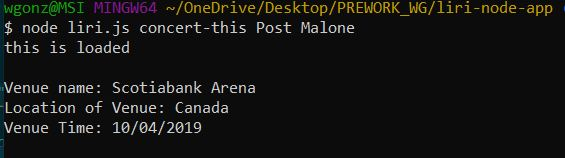
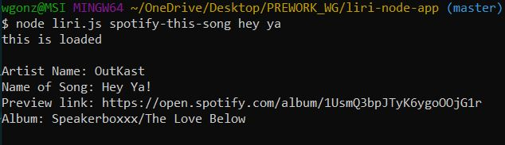
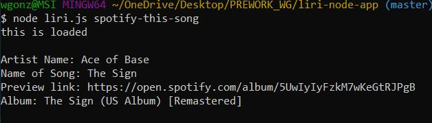
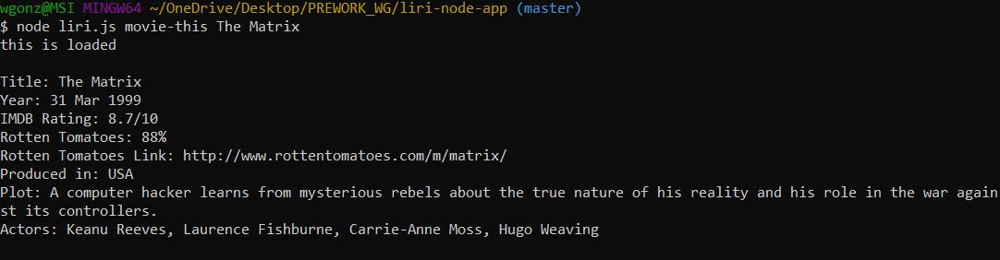
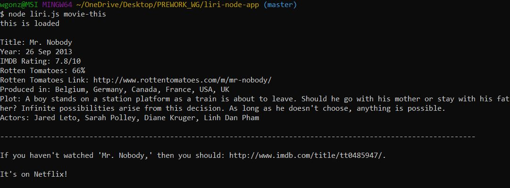
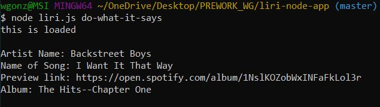

# liri-node-app
LIRI is a Language Interpretation and Recognition Interface. LIRI will be a command line node app that takes in parameters and gives you back data.

## LIRI operates with these commands:

* concert-this
* spotify-this-song
* movie-this
* do-what-it-says

## Technologies Used:
1. Node.js
2. Javascript
3. Axios
4. APIs
5. Moment.js

## npm packages:
* spotify
* dotenv
* moment

## How to run LIRI

* Step One: node liri concert-this 

    This will search the Bands in Town Artist Events API for an artist and render the following information about each event to the terminal:

   - Name of the venue
   - Venue location
   - Date of the Event

   

* Step Two: node liri spotify-this-song <entry here>.

    This will show the following information about the song in your terminal/bash window:

    - Artist(s)
    - The song's name
    - A preview link of the song from Spotify
    - The album that the song is from

    

    If no song is provided then the program will default to "The Sign" by Ace of Base

    

* Step Three: node liri.js movie-this <entry here>.

    This will output the following information to your terminal/bash window:

    - Title of the movie.
    - Year the movie came out.
    - IMDB Rating of the movie.
    - Country where the movie was produced.
    - Language of the movie.
    - Plot of the movie.
    - Actors in the movie.
    - Rotten Tomatoes Rating.
    - Rotten Tomatoes URL.

    

    If the user doesn't type a movie in, the program will output data for the movie 'Mr.Nobody.'

    

* Step Four: node liri.js do-what-it-says

    This will output the command placed in random.txt file

    

* Developer:
    William Gonzales

